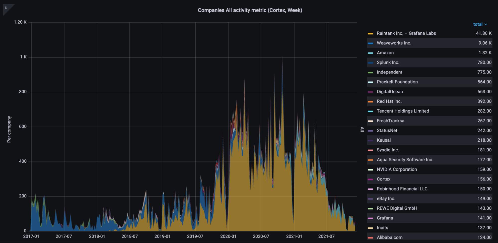
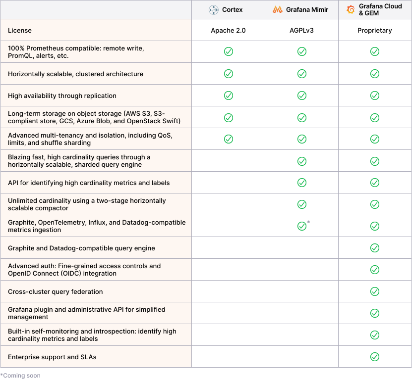

## Mimir 简介
Grafana Mimir 是目前最具扩展性、性能最好的开源时序数据库，Mimir 允许你将指标扩展到 1 亿。它部署简单、高可用、多租户支持、持久存储、查询性能超高，比 Cortex 快 40 倍。 Mimir 托管在 https://github.com/grafana/mimir 并在 AGPLv3 下获得许可。

[B站：Grafana Mimir 发布 目前最具扩展性的开源时序数据库](https://www.bilibili.com/video/BV1s34y1s7sw/)

Mimir 是指标领域的一个新项目，站在巨人的肩膀上。为了理解 Mimir，我们需要回顾一下 Cortex 的历史。

## 源自 Prometheus

2016 年在 Weaveworks 工作时，我与 Prometheus 的联合创始人兼维护者 Julius Volz 一起启动了 Cortex 项目。该项目的目标是构建一个可扩展的与 Prometheus 兼容的解决方案，旨在作为 SaaS 产品运行。在我加入 Grafana Labs 后，我们与 Weaveworks 合作，将 Cortex 转移到一个中立的地方，即云原生计算基金会。[Cortex 于 2018 年 9 月 20 日被接受为 CNCF 沙盒项目](https://www.cncf.io/blog/2018/09/20/cncf-to-host-cortex-in-the-sandbox/?pg=blog&plcmt=body-txt)，两年后[晋升为孵化项目](https://www.cncf.io/blog/2020/08/20/toc-welcomes-cortex-as-an-incubating-project/?pg=blog&plcmt=body-txt)。CNCF 为两个公司在项目上提供了一个公平的竞争协作环境，这确实很棒，Grafana Labs 和 Weaveworks 都积极参与其中。Cortex 被 20 多个组织使用，并得到了[大约 100 名开发人员](https://github.com/cortexproject/cortex/graphs/contributors)的贡献。 Grafana Labs 的员工无疑是 Cortex 项目的最大贡献者，在 2019 - 2021 年期间贡献了约 87% 的代码提交。

来源: cortex.devstats.cncf.io

## 开源和商业

来看看这些产品 **Cortex、Loki、Tempo 和 Grafana Enterprise Metrics**

过去，Cortex 已经成为很多项目的基础，包括 Grafana Loki（类似 Prometheus，用于日志）、Grafana Tempo（用于分布式追踪）、Grafana Enterprise Metrics（GEM）。Grafana Labs 于 2020 年发布该项目，让 Prometheus 能适应更大的组织、加入很多企业级特性（比如安全、访问控制、简化管理UI），旨在他们卖给那些不想自己构建但还想使用这类产品的企业。

同时，云服务商和 ISVs（独立软件开发商）也推出了基于 Cortex 的产品，但是对项目却没啥贡献。一家公司，通过创造技术来降低其他公司的成本，但是却对开源技术不感兴趣。这是不可持续并且非常不好的。为了回应，我们后面更偏向于对 GEM 投资而不是 Cortex。作为一家热衷于开源的公司，这一点让大家很不舒服。我们认为，GEM 中一些可扩展性相关和性能相关的特性应该被开源。

大家应该知道，去年我们[重新授权了一些开源项目](https://grafana.com/blog/2021/04/20/grafana-loki-tempo-relicensing-to-agplv3/?pg=blog&plcmt=body-txt)，把 Grafana, Grafana Loki 和 Grafana Tempo, 从 Apache 2.0 调整到 AGPLv3（OSI 批准的许可证，保留了开源自由，同时鼓励第三方将代码贡献回社区）从 Grafana Labs 开创之初，我们的目标就是要围绕我们的开源项目构建可持续发展的商业，将商业产品的收入重新投入到开源技术和社区。AGPL 许可能平衡商业和开源之间的关系。

## 介绍 Grafana Mimir

Mimir 集合了 Cortex 中的最佳功能和为 GEM & Grafana Cloud 大规模运行而研发的功能，所有这些都在 AGPLv3 许可下。Mimir 包含以前的商业功能，包括无限制基数（使用水平可扩展的 “split” 压缩器实现）和快速、高基数查询（使用分片查询引擎实现）

## 产品比较

Cortex、Grafana Mimir 和 Grafana Cloud & Grafana Enterprise Metrics 比较

在从 Cortex 开始构建 Mimir 的过程中，团队有机会消除五年来欠下的技术债务，删除未使用的功能，使项目更易于维护，简化配置并改进文档。希望通过这次投资，在 Mimir 上的努力会让其更加易用，从而帮助社区更好的发展。

对于 Grafana Cloud 和 Grafana Enterprise Metrics 的用户来说，没有任何变化，因为这两种产品从几个月前就都基于 Grafana Mimir。对于正使用 Cortex 的组织，在一定程度的主版本升级限制内，Mimir 可以作为替代品。大多数情况下，从 Cortex 迁移到 Mimir只需不到 10 分钟。

## 指标的未来

Mimir 的愿景不是成为“最具可扩展性的普罗米修斯”，而是“最具可扩展性的泛指标时序数据库”。用户无需更改代码即可将指标发送到 Mimir。今天，Mimir 可以原生使用 Prometheus 指标。很快 Influx、Graphite、OpenTelemetry 和 Datadog 将紧随其后。这是我们“大帐篷”理念的一部分：正如 Grafana 是可视化所有数据的一体化工具一样，Mimir 可以成为存储所有指标的一体化工具。

Mimir 发布以后，强大、全面、可插拔的开源观测工具栈已经形成：LGTM（Loki 用户日志, Grafana 用于可视化, Tempo 用于跟踪, Mimir 用于指标），快去体验吧。

想了解更多，阅读 [Q&A with our CEO, Raj Dutt](https://grafana.com/blog/2022/03/30/qa-with-our-ceo-about-grafana-mimir/?pg=blog&plcmt=body-txt)，注册4月26日网络研讨会 [介绍 Grafana Mimir，能扩展1亿指标的开源的时序数据库，不仅如此](https://grafana.com/go/webinar/intro-to-grafana-mimir/?pg=blog&plcmt=body-txt)